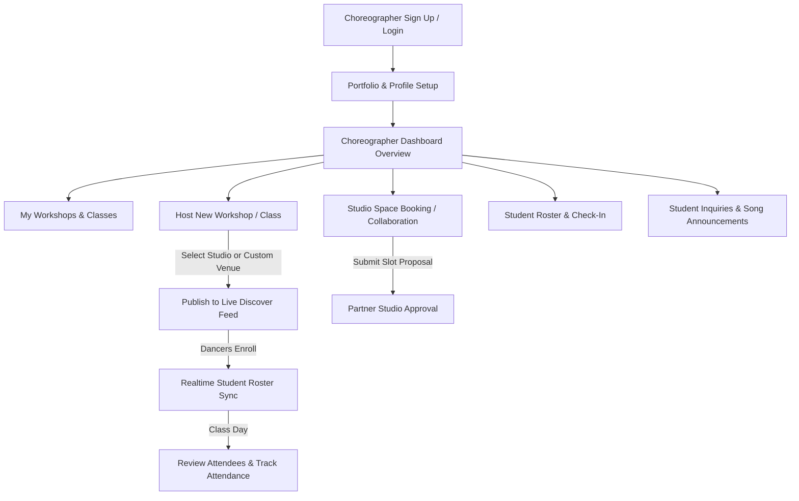
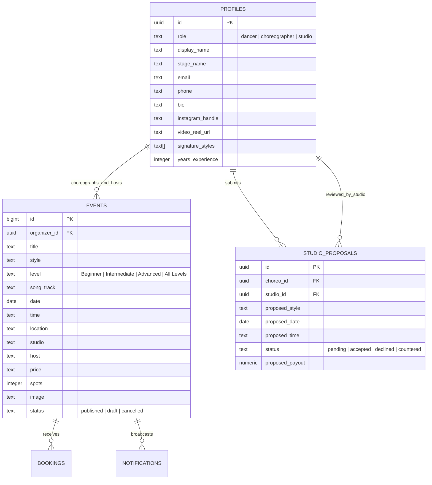

# 💃 DanceHut Choreographer Portal — Product & Workflow Specification

> **A complete blueprint for the Choreographer and Dance Instructor experience on DanceHut**
> 
> This document defines the end-to-end choreographer workflow, user interface layout, feature scope, database schema extensions, and collaboration model with partner dance studios.

---

## 📌 1. Overview & Choreographer Persona

### Target Audience
* **Independent Choreographers & Dance Educators**: Freelance instructors, crew leaders, and dance artists in Bengaluru (Hip-Hop, Heels, Urban Choreo, Contemporary, Bolly-Hop, Waacking, Afro, etc.) who host their own workshops, masterclasses, and intensives.
* **Studio-Affiliated Instructors**: Resident instructors who teach regular batches at partner dance studios.

### Primary Goals
1. **Effortless Workshop Hosting & Publishing**: Launch masterclasses and choreography intensives in minutes with automated registration, ticketing, and live discover feed distribution.
2. **Studio Space Discovery & Booking**: Find, propose, and book studio rooms across Bengaluru's top dance spaces with clear floor specifications, hourly slots, and amenities.
3. **Student Roster & Community Engagement**: Track registrations in real time, view attendee experience levels, announce song tracks and dress codes, and field student questions.
4. **Professional Portfolio & Brand Building**: Showcase signature styles, dance video reels, Instagram handles, and student testimonials to build a loyal student following.
5. **Earnings & Class Analytics**: Monitor ticket sales, gross revenue, class attendance rates, and repeat student engagement.

---

## 🔄 2. End-to-End Choreographer User Flow



### Choreographer Lifecycle Phases:
1. **Onboarding & Portfolio Creation**:
   - Select "I'm a choreographer" role during signup.
   - Set up profile: Stage name, bio, signature dance styles (tags), years of experience, Instagram handle, and featured dance video reel (YouTube/Instagram URL).
2. **Workshop Creation & Publishing**:
   - Define class details: Song track, dance style, difficulty level (Beginner, Intermediate, Advanced, Open Level), date, time, and duration.
   - Choose venue: Select a partner studio in Bengaluru (e.g. Step & Groove Koramangala) or enter a custom studio location.
   - Set pricing (₹ per spot), capacity cap, and upload workshop poster art.
   - Publish directly to the live DanceHut Discover feed.
3. **Pre-Class Communication & Prep**:
   - Send prep broadcasts to enrolled students (Song piece preview, choreography footwear/knee pads recommendations).
   - Answer 1:1 dancer inquiries about class difficulty or choreography pacing via the integrated Messages inbox.
4. **Class Day & Student Check-In**:
   - Access real-time student roster on mobile.
   - Verify tickets and mark attendance with 1-click status toggles.
5. **Post-Class Follow-Up**:
   - Review class earnings and repeat student counts.
   - Send thank-you notes or video recap links to attendees.

---

## 🖥️ 3. Choreographer Interface & Screen Layout

When an authenticated user has `role: 'choreographer'`, DanceHut provides a dedicated **Choreographer Workspace**:

```
┌─────────────────────────────────────────────────────────────────────────────────────────┐
│ 🎵 dancehut  [Choreo Portal: Ananya Roy ✨]                      [+ Host Class] [Avatar]│
├───────────────────┬─────────────────────────────────────────────────────────────────────┤
│ 📊 Dashboard      │  👋 Welcome back, Ananya!                                           │
│ 💃 My Classes     │  ┌──────────────┬──────────────┬──────────────┬──────────────────┐  │
│ ➕ Host Workshop  │  │ 3 Upcoming   │ 54 Students  │ ₹38,000      │ 88% Fill Rate    │  │
│ 🏢 Studio Spaces  │  │ Masterclasses│ Enrolled     │ Est. Revenue │ This Month       │  │
│ 👥 Student Roster │  └──────────────┴──────────────┴──────────────┴──────────────────┘  │
│ 💬 Messages (2)   │                                                                     │
│ 🔔 Broadcasts     │  🎯 NEXT UPCOMING WORKSHOP (Today, 18:00)                           │
│ 👤 My Portfolio   │  ┌───────────────────────────────────────────────────────────────┐  │
│                   │  │ Urban Choreo: "Too Sweet" | Step & Groove Koramangala          │  │
│                   │  │ 28/30 Confirmed • 2 Spots Left | [View Roster] [Send Song Tip]│  │
│                   │  └───────────────────────────────────────────────────────────────┘  │
└───────────────────┴─────────────────────────────────────────────────────────────────────┘
```

### Key Views & Navigation Tabs:

| Tab / View | Key Features & Responsibilities |
|---|---|
| **1. Dashboard (`ChoreoOverviewTab`)** | Overview of upcoming workshops, total enrolled students, estimated gross earnings, average fill rate, next class countdown, and quick actions. |
| **2. My Classes (`ChoreoWorkshopsTab`)** | Filterable list of hosted workshops (Upcoming, Past, Drafts). Quick triggers: View Student Roster, Edit Details, Share Class Link, Duplicate Workshop, or Cancel with notice. |
| **3. Host Workshop (`CreateWorkshopModal`)** | Streamlined class creation form with style selection, level tag, song track name, partner studio picker / custom location, date & time, price, and cover image. |
| **4. Studio Spaces (`StudioDiscoveryTab` / Collaboration)** | Explore partner studios across Bengaluru, view room capacities, sprung wood flooring specs, sound equipment, and submit workshop slot proposals. |
| **5. Student Roster (`AttendeeRosterModal`)** | Live searchable list of confirmed dancers for each workshop, dancer experience notes, and 1-click attendance confirmation. |
| **6. Messages & Inquiries (`MessagesTab`)** | Direct communication with registered dancers (prerequisites, song questions) and partner studio managers. |
| **7. Announcements (`StudioBroadcastModal` / Choreo Mode)** | Broadcast song preview links, dress code reminders, or schedule changes to all attendees of a specific workshop. |
| **8. Portfolio & Profile (`ChoreoProfileTab`)** | Showcase stage name, bio, signature styles, dance video showreel link, Instagram handle, and teaching credentials. |

---

## 📋 4. Feature Scope Matrix

### 🟢 Phase 1: Choreographer Core Workspace (Immediate Phase 1 Scope)
- [x] **Role Selection & Attribution**: Seamless signup/login as "I'm a choreographer", syncing role badge and stage name to `profiles`.
- [ ] **Choreographer Dashboard (`ChoreoOverviewTab`)**:
  - Live metric cards: Active workshops, total registered students, estimated revenue, and fill rates.
  - Next class spotlight card with countdown and direct roster access.
- [ ] **Choreographer Class Manager (`ChoreoWorkshopsTab`)**:
  - Manage all hosted classes with status badges (`Upcoming`, `Today`, `Completed`).
  - 1-click access to student rosters, class edits, duplicate class, and cancellation workflows.
- [ ] **Host Workshop Flow**:
  - Choreographer-tailored class creation wizard supporting song track title, skill level (Beginner/Intermediate/Advanced), studio venue selection, price, and spots.
  - Instant synchronization to the public Bengaluru Discover feed.
- [ ] **Live Student Roster**:
  - View real-time attendee list per workshop with booking timestamps and attendance toggles.
- [ ] **Choreographer Portfolio & Profile (`ChoreoProfileTab`)**:
  - Edit bio, signature styles (Hip-Hop, Heels, Contemporary, etc.), Instagram link, and showcase video reel URL.
- [ ] **Student Communication & Broadcasts**:
  - Send song track previews and prep alerts to confirmed dancers via `notify_event_audience`.
  - 1:1 messaging inbox with dancers inquiring about class level and choreography style.

---

### 🟡 Phase 2: Studio Collaboration & Slot Proposals
- [ ] **Studio Space Directory**:
  - Browse Bengaluru partner studios with room photos, dimensions, floor types (sprung wood/marley), and available rental slots.
- [ ] **Slot Booking & Workshop Proposals**:
  - Submit workshop proposals directly to studio owners (Date, time slot, expected capacity, revenue split vs fixed rental).
  - Real-time status tracker (`Proposed`, `Accepted`, `Counter-Offer`, `Declined`).
- [ ] **Multi-Session Courses & Intensives**:
  - Create and sell multi-day choreography bootcamps and progressive batches (e.g. 4-week Heels Intensive).
- [ ] **Class Video Recap Sharing**:
  - Post post-class choreography videos or private drive links exclusively to attendees.

---

### 🔵 Phase 3: Creator Monetization & Community Growth
- [ ] **Automated Revenue Splits**:
  - Integrated payment gateway (Razorpay Route / Stripe Connect) with automated payouts split between Choreographer and Partner Studio.
- [ ] **Student Follow & Notification Alerts**:
  - Dancers can "Follow" choreographers to receive instant alerts whenever a new workshop is announced.
- [ ] **Verified Choreographer Badge**:
  - Verified instructor badges for established dance educators and international masterclass artists.
- [ ] **Student Reviews & Testimonials**:
  - Verified attendees can leave ratings, tags (e.g., "Great Breakdown", "High Energy"), and written feedback.

---

## 🗄️ 5. Database Schema & Architecture Extensions

The choreographer workflow utilizes the shared `events`, `bookings`, `profiles`, and `notifications` tables with key role-based relationships:



---

## 🤝 6. Studio & Choreographer Synergy

DanceHut connects Studios and Choreographers through a collaborative two-sided creator model:

1. **Independent Hosting**: Choreographers can host classes at their own designated spaces or rent studio halls directly.
2. **Partner Studio Collaboration**: Studios can list open slots, and choreographers can pitch signature masterclasses, creating a win-win for studio room utilization and choreographer reach.
3. **Unified Discover Feed**: Whether hosted by a Studio or an Independent Choreographer, all classes appear in the unified Discover feed with clear host and studio attribution.
