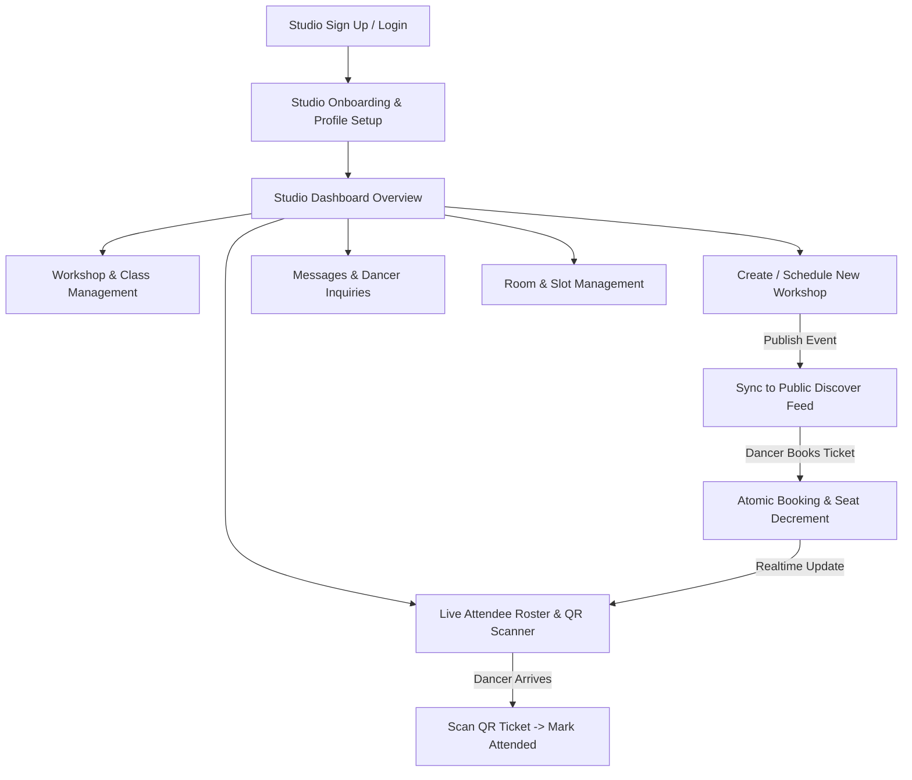
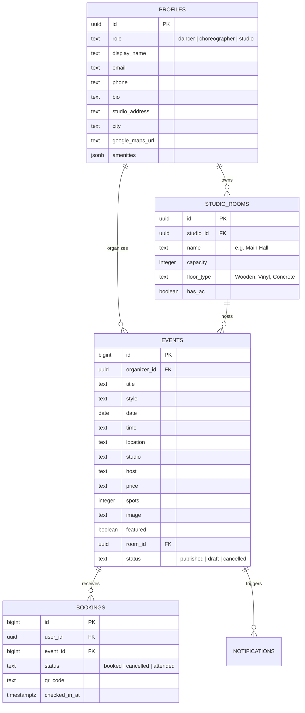

# 🏢 DanceHut Studio Portal — Product & Workflow Specification

> **A complete blueprint for the Studio owner & organizer experience on DanceHut**
> 
> This document defines the end-to-end studio workflow, user interface layout, feature scope, database schema extensions, and security model for dance studios and event organizers.

---

## 📌 1. Overview & Studio Persona

### Target Audience
* **Dance Studio Owners / Managers**: Commercial studios in Bengaluru (e.g. in Koramangala, Indiranagar, HSR, Church Street) looking to maximize studio room utilization and streamline class registrations.
* **Independent Organizers / Dance Crews**: Teams hosting recurring dance workshops, masterclasses, and bootcamps.

### Primary Goals
1. **Effortless Event Management**: Create, schedule, publish, and edit dance workshops with multi-tiered pricing, capacity caps, and instructor tagging.
2. **Real-time Occupancy & Live Check-in**: Track ticket sales in real time, view attendee rosters, and scan dancer QR codes at the studio front desk without paper lists.
3. **Choreographer & Space Collaboration**: Manage multi-room schedules and review slot booking proposals from guest choreographers.
4. **Dancer Engagement & Rapid Communication**: Broadcast instant updates (e.g., room change, schedule delay, shoe guidelines) directly to registered dancers.

---

## 🔄 2. End-to-End Studio User Flow



### Studio Lifecycle Phases:
1. **Onboarding & Space Setup**:
   - Register studio profile (Studio name, tagline, address, neighborhood, Google Maps pin).
   - Add studio amenities (Wooden flooring, AC, Full-length mirrors, Sound system, Parking).
   - Configure rooms/halls (e.g., *Main Hall - Capacity 40*, *Studio B - Capacity 15*).
2. **Event Creation & Publishing**:
   - Define workshop details (Style, level, date, time, duration, instructor, price, total spots).
   - Upload high-resolution workshop poster or select curated studio banner.
   - Publish live to the Bengaluru Discover feed immediately or save as draft.
3. **Pre-Class Management**:
   - Monitor live registration count and remaining spots.
   - Receive and respond to dancer inquiries via the integrated messaging inbox.
   - Send targeted announcement notifications (e.g. footwear advice or schedule updates).
4. **Day-of-Class & Check-In**:
   - Open the **Front Desk QR Scanner** on tablet/mobile or manual attendee search.
   - Scan dancer tickets to mark attendance in real time.
5. **Post-Class & Analytics**:
   - Review attendance rate, gross revenue, and repeat dancer statistics.

---

## 🖥️ 3. Studio Interface & Screen Layout

When an authenticated user has the `role: 'studio'`, the top-level navigation and views transition to a dedicated **Studio Workspace**:

```
┌─────────────────────────────────────────────────────────────────────────────────────────┐
│ 🎵 dancehut  [Studio Portal: Step & Groove Studio ▼]             [Live Scanner] [Avatar]│
├───────────────────┬─────────────────────────────────────────────────────────────────────┤
│ 📊 Dashboard      │  👋 Good afternoon, Step & Groove!                                 │
│ 📅 My Workshops   │  ┌──────────────┬──────────────┬──────────────┬──────────────────┐  │
│ ➕ Create Class   │  │ 4 Active     │ 86/100 Spots │ ₹42,500      │ 92% Check-In Rate│  │
│ 📱 QR Check-In    │  │ Workshops    │ Booked       │ Total Revenue│ Last 7 Days      │  │
│ 💬 Messages (3)   │  └──────────────┴──────────────┴──────────────┴──────────────────┘  │
│ 🔔 Broadcasts     │                                                                     │
│ 🚪 Rooms & Slots  │  🎯 TODAY'S SCHEDULE (23 Aug)                                       │
│ ⚙️ Studio Profile │  ┌───────────────────────────────────────────────────────────────┐  │
│                   │  │ 18:00 - 19:30 | Urban Choreography (Ananya R.)                │  │
│                   │  │ Room: Main Studio A | 28/30 Booked | [View Roster] [Scan QR]  │  │
│                   │  ├───────────────────────────────────────────────────────────────┤  │
│                   │  │ 20:00 - 21:30 | Heels Foundation (Priya S.)                   │  │
│                   │  │ Room: Studio B      | 15/15 (SOLD OUT) | [View Roster] [Scan] │  │
│                   │  └───────────────────────────────────────────────────────────────┘  │
└───────────────────┴─────────────────────────────────────────────────────────────────────┘
```

### Key Views & Navigation Tabs:

| Tab / View | Key Features & Responsibilities |
|---|---|
| **1. Overview (Dashboard)** | High-level metrics (Active workshops, booked capacity, total revenue), today's timeline, upcoming classes quick actions, and latest booking activity feed. |
| **2. My Workshops** | Filterable list of workshops (Upcoming, Live Today, Past, Drafts). Quick actions: View Roster, Edit Details, Send Announcement, Cancel/Refund, or Duplicate Class. |
| **3. Create Workshop (Wizard)** | 4-step event builder: (1) Basic Info & Style, (2) Date, Time & Studio Room, (3) Instructor & Bio, (4) Ticket Pricing, Capacity & Cancellation Policy. |
| **4. QR Check-in & Roster** | Real-time front-desk tablet/mobile view with camera QR scanner, ticket search, and live check-in progress bar (`Attended` vs `Pending`). |
| **5. Messages & Inquiries** | 1:1 conversation threads with dancers inquiring about workshops, level prerequisites, or studio directions. |
| **6. Broadcast Announcements** | Targeted notification dispatcher sending in-app alerts and emails to enrolled attendees of specific workshops. |
| **7. Studio Profile & Rooms** | Studio bio, cover images, neighborhood, amenities checklist, Google Maps link, and room capacity management. |

---

## 📋 4. Feature Scope Matrix

### 🟢 Phase 1: MVP Studio Core (Immediate Focus)
- [x] **Role Selection & Profile Attribution**: Studio role selection on signup, syncing studio name to `profiles` table.
- [ ] **Studio Dashboard Overview**: Live count of active hosted workshops, total registered dancers, and today's schedule preview.
- [ ] **Workshop Creator (Create Class Modal)**:
  - Form fields: Title, Style (Hip-Hop, Contemporary, Heels, etc.), Date, Start/End Time, Room/Venue Address, Instructor name, Price (₹), Total Spots, Cover Image URL / Preset.
  - Inserts directly into `events` table with `organizer_id = auth.uid()` and auto-populates studio name.
- [ ] **Workshop Management Feed**:
  - Studio view of all classes organized by date.
  - Ability to edit event details (time, venue notes, remaining spots).
  - Ability to delete/cancel upcoming events with automatic cascade alert.
- [ ] **Live Attendee Roster Modal**:
  - View full list of registered dancers for any workshop (Name, email, booking timestamp, status).
  - Manual 1-click "Mark as Attended" toggle.
- [ ] **QR Code Check-in Scanner**:
  - In-browser camera QR code reader (or manual 6-character Ticket ID entry).
  - Validates booking authenticity in Supabase and marks booking status as `attended`.
- [ ] **Studio-to-Dancer Broadcast Alerts**:
  - Trigger `notify_event_audience` stored procedure to broadcast urgent announcements to all registered attendees of a class.

---

### 🟡 Phase 2: Enhanced Studio Operations & Collaboration
- [ ] **Choreographer Slot Proposals**:
  - Choreographers can view available studio room slots and submit workshop proposals.
  - Studio owners can Accept / Reject / Counter-propose slot bookings.
- [ ] **Multi-Room Studio Management**:
  - Define custom rooms with distinct dimensions and max capacities (e.g., Studio 1, Studio 2, Private Rehearsal Room).
  - Prevent double-booking rooms during event creation.
- [ ] **Batch / Recurring Class Scheduling**:
  - Schedule recurring weekly batches (e.g. "Every Tuesday & Thursday at 7:00 PM for 4 weeks").
- [ ] **Direct Inquiry Chat**:
  - Workshop-specific group chat or 1:1 direct messaging between host and registered dancers.

---

### 🔵 Phase 3: Commercial & Analytics Powerhouse
- [ ] **Payment Gateway & Payouts**:
  - Automated Razorpay Route / Stripe Connect payouts directly to studio bank accounts.
  - Split commission payouts between Studio and Guest Choreographers.
- [ ] **Studio Analytics Dashboard**:
  - Revenue trends, fill rates by dance style, most popular time slots, and repeat dancer cohorts.
- [ ] **Public Studio Showcase Page**:
  - Dedicated public studio profile page (`/studio/:id`) with photo gallery, customer reviews, instructor roster, and active schedule.
- [ ] **Multi-staff Permissions**:
  - Add front-desk staff accounts with restricted permissions (Check-in scanner only, no revenue access).

---

## 🗄️ 5. Database Schema & Architecture Extensions

To support the studio workflow without breaking the existing dancer schema, the following schema additions will be introduced:



### Required Migration Enhancements:
1. **Add `organizer_id` to `public.events`**:
   - References `public.profiles(id)` where `role = 'studio' or role = 'choreographer'`.
2. **Add `status` and `checked_in_at` to `public.bookings`**:
   - Enables QR check-in timestamping and attendance reconciliation.
3. **RLS Policies for Studio Role**:
   - `events` INSERT / UPDATE / DELETE policies allowing studios to manage events where `organizer_id = auth.uid()`.
   - `bookings` SELECT / UPDATE policies allowing organizers to view attendee lists and update attendance status for their own events.

---

## 🛡️ 6. Security, Validation & Business Rules

1. **Anti-Overselling Guarantee**:
   - The atomic stored procedure `book_event` continues to enforce strict locking so total bookings never exceed `events.spots`.
2. **Authorized Check-In Verification**:
   - Only the event's designated `organizer_id` (or studio admin) has permission to scan and transition a booking to `attended`.
3. **Safe Cancellation & Notification Cascades**:
   - If a studio cancels an event, the system automatically triggers a high-priority `event_update` notification to all confirmed attendees with a refund/credit note.
4. **Venue Mapping**:
   - Studio profile addresses automatically generate standardized Google Maps directions links for all hosted workshops.
